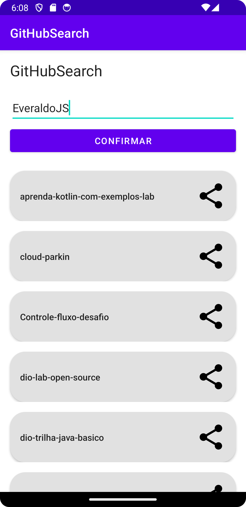
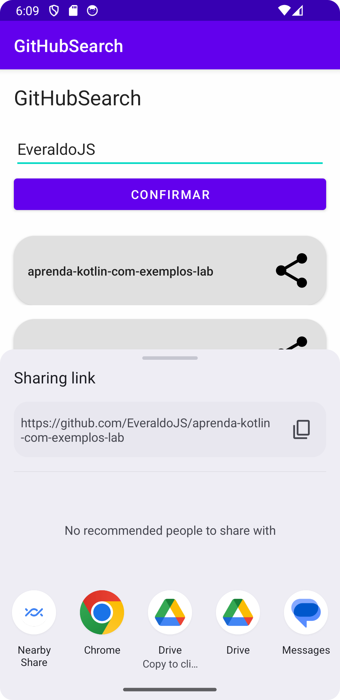

# desafio-github-search
Criando um App Android para compartilhar seu portfolio de projeto 

Criar um App Android simples que armazene um usuário do GitHub (informado em uma tela inicial) e liste todos os seus repositórios públicos. Garanta que o nome do usuário seja salvo e o App tenha a capacidade de redefinir essa informação.

